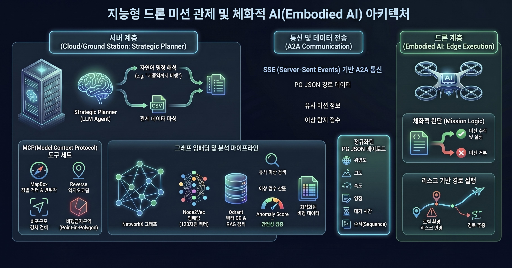
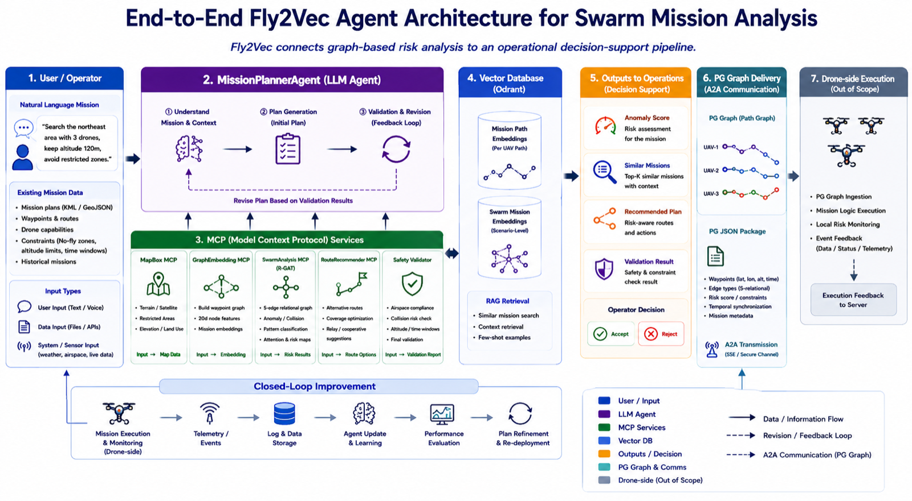
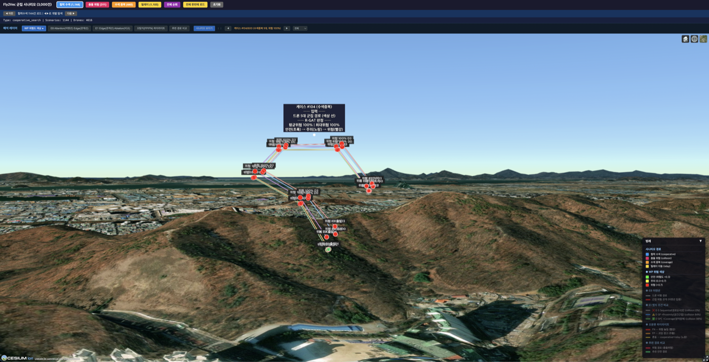
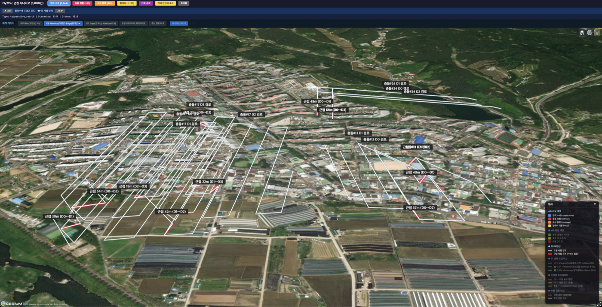
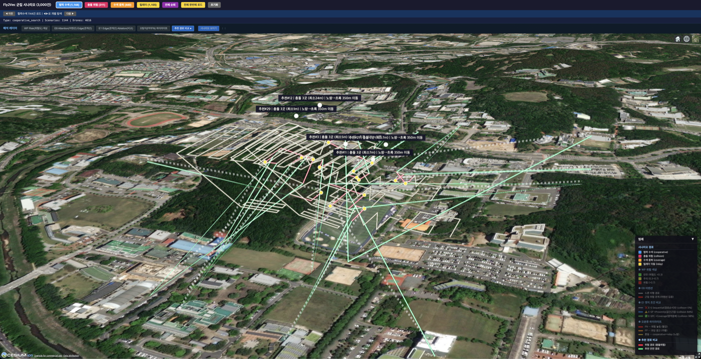

<p align="center">
  
</p>

# Fly2Vec-Swarm

> R-GAT 기반 군집 드론 임무 그래프의 공간적 의미 학습 및 지능형 임무 계획 분석 에이전트 체계

## 시스템 아키텍처



자연어 질의 → MissionPlannerAgent(이해·계획·검증-수정 루프) → MCP 도구군(GraphEmbedding·SwarmAnalysis·RouteRecommender) → Qdrant 벡터 DB → 운용 산출·전달로 이어지는 E2E 분석 파이프라인.

## 3D 분석 대표 화면

**WP 위험도 분해** — 5대 수색중복 케이스의 군집 경로 판정을 웨이포인트 노드별 위험도로 분해(평균·최대 위험 100%, 전 노드 빨강):



**E8 충돌 근접선** — 충돌 시나리오의 최근접 드론쌍(<150m)을 빨간 관계선으로 강조:



**추천 경로 진단** — 도심 상공 군집 격자에서 충돌 WP를 식별하고 350m 밀어낸 수정 경로(초록)를 입력 경로와 3D로 비교:



## Quick Start

### 0. 사전 준비

```bash
# uv 설치 (Python 패키지 매니저)
curl -LsSf https://astral.sh/uv/install.sh | sh

# Python 3.12 (uv로 자동 설치됨)
# Docker Desktop 설치 필요
```

### 1. 환경 설정

```bash
# 클론
git clone git@github.com:swjo0330/Fly2Vec-Swarm.git
cd Fly2Vec-Swarm

# 의존성 설치
cd fly2vec
uv sync      # Python 3.12 + 전체 의존성 자동 설치
cd ..

# 환경변수
cp fly2vec/.env.example fly2vec/.env
# .env에 GROQ_API_KEY 설정 (무료: https://console.groq.com)
```

### 2. Docker 실행

```bash
cd fly2vec
docker compose -f docker/docker-compose.yml -p fly2vec up -d
```

6개 서비스가 기동됩니다:

| 서비스 | 포트 | 역할 |
|--------|------|------|
| qdrant-fly2vec | 6340 | 벡터DB (128d COSINE) |
| graph-embedding-mcp | 8050 | 단일 경로: embed + anomaly + RAG + recommend |
| swarm-analysis-mcp | 8051 | 군집: R-GAT 패턴/이상 + 충돌 탐지 |
| route-recommender-mcp | 8052 | 4축 다기준 경로 추천 (Safety/Efficiency/Similarity/SwarmCompat) |
| mapbox-mcp | — | MapBox MCP (경로 생성) |
| fly2vec-agent | 8060 | LLM Agent (검증-수정 루프) |

### 3. 데이터 로드

```bash
# Qdrant에 실 관제 데이터 2,261건 벌크 로드
cd fly2vec
PYTHONPATH=.. QDRANT_URL=http://localhost:6340 uv run python -m fly2vec.src.data.loader
```

### 4. A2A 클라이언트 실행

```bash
python run_client.py "서울역에서 인천공항까지 50m 고도로 비행 계획"
```

### 5. R-GAT 재학습 (선택)

```bash
# 사전학습 모델 포함 — 스킵 가능
# 최종 20d E-ALL 모델 학습·저장은 v3 종합 실험에 포함됨
uv run python scripts/run_v3_comprehensive.py
# (구버전) R-GAT 15d 단독 학습
uv run python scripts/train_rgat_15d.py
```

---

## 실험 체계

### 용어 정리

| 영어 | 한국어 | 설명 |
|------|--------|------|
| Edge | 관계선 | 드론 간 또는 WP 간 연결 |
| Sequential | 경로순서 | 같은 드론의 WP 순서 연결 |
| Proximity | 공간근접 | 다른 드론과 500m 이내 |
| Coverage | 영역중복 | 다른 드론과 같은 100m 격자 |
| Temporal | 시간연결 | 운용 순서상 인접 드론의 마지막 WP ↔ 다음 드론의 첫 WP 핸드오프 연결 |
| Anomaly | 극근접위험 | 다른 드론과 50m 이내 |
| Attention | 어텐션 | 모델이 어디에 주의를 기울이는지 |
| Ablation | 제거실험 | 요소를 하나씩 제거하며 기여도 측정 |
| Feature | 피처(특성) | 노드/WP에 부여하는 수치 정보 |
| Collision | 충돌 | 드론 간 충돌 위험 |

### Feature(피처) 설계 — 15d → 20d

#### 기존 15d = "이 드론 혼자의 비행 특성"

| # | Feature(피처) | 의미 | 정규화 범위 |
|---|------|------|------|
| 1 | lat_norm | 위도 | 33~38 |
| 2 | lon_norm | 경도 | 124~132 |
| 3 | alt_norm | 고도 | 0~500m |
| 4 | seq_ratio | 경로 내 순서 비율 | 0~1 |
| 5 | speed_norm | 비행 속도 | 0~15 m/s |
| 6 | dist_prev | 이전 WP까지 거리 | 0~1000m |
| 7 | dist_next | 다음 WP까지 거리 | 0~1000m |
| 8 | bearing | 비행 방위각 | 0~360° |
| 9 | bearing_change | 방향 변화(커브) | 0~180° |
| 10 | hold_sec | 대기 시간 | 0~60s |
| 11 | alt_change | 고도 변화 | 0~100m |
| 12 | is_start | 출발점 여부 | 0/1 |
| 13 | is_end | 도착점 여부 | 0/1 |
| 14 | is_land | 착륙점 여부 | 0/1 |
| 15 | terrain_type | 지형 유형 | 0~5 |

#### 추가 5d = "이 드론과 주변 드론들의 공간 관계" (15d → 20d 확장)

| # | Feature(피처) | 질문 | 영향 (Exp4 제거 시) |
|---|------|------|------|
| 16 | min_inter_drone_dist | "가장 가까운 다른 드론이 얼마나 가까운가?" | **이상탐지 -9.8%p** |
| 17 | relative_speed | "서로 접근/이탈 중인가?" | (5개 통합) |
| 18 | heading_divergence | "정면 마주오는가, 같은 방향인가?" | (5개 통합) |
| 19 | altitude_separation | "같은 높이인가, 수직 분리인가?" | (5개 통합) |
| 20 | temporal_overlap | "주변 100m 안에 다른 드론이 몇 대인가?" | (5개 통합) |

**핵심**: 기존 15d는 개별 드론의 비행 모양만 알 수 있고 다른 드론이 어디 있는지 모름. 추가 5d로 드론 간 공간 관계를 노드에 직접 넣어 Attention(어텐션) 희석을 보상 → E-ALL 20d: 이상탐지 **99.7%**, 충돌탐지 **96.4%**

### 데이터 버전

| 버전 | cooperative | relay | collision | coverage | 특징 |
|------|-----------|-------|-----------|----------|------|
| v1 | 다른 영역 배치 | 일렬 배치 | 30-150m 근접 | <50m 겹침 | 원본 — Proximity(공간근접) 핵심 |
| v2 | 같은 경로 복사+같은 영역 | 같은 경로+일렬 | 유지 | 유지 | Sequential(경로순서) 동일 문제 |
| **v3** | **다른 실 경로+같은 영역** | **끝→시작 핸드오프** | 유지 | 유지 | **Temporal(시간연결) 핵심, 패턴 86.8%** |
### v3 종합 실험 (2026-05-29, report12) — 최종

6개 실험을 v3 데이터로 한번에 실행:

```bash
fly2vec/.venv/bin/python scripts/run_v3_comprehensive.py
```

### 핵심 해석 방법 (Key Interpretation Methods)

| 해석 | 발견 | 연구적 의의 |
|------|------|-----------|
| **Edge(관계선) Ablation(제거실험)** | Temporal(시간연결) 추가 시 패턴분류 48.8%→86.8% | 어떤 관계가 핵심인지 정량 입증 |
| Attention 가중치 | 15d E-ALL은 L1 Proximity 0.36 최고 (최종 20d E-ALL은 L1 0.230·L2 0.273으로 평탄화) |
| **Feature(피처) Ablation(제거실험)** | 드론간 관계 5개 제거 시 이상탐지 -9.8%p | 최소 거리가 이상탐지의 핵심 |
| **UMAP 임베딩 시각화** | 정상 유형 순수 군집(purity 1.0)·이상 2종(collision+coverage)은 한 군집 병합(purity 0.56) | 혼동행렬 coverage→collision 누수와 교차검증 |
| **20d Feature(피처) 확장** | 이상탐지 99.7%, Collision(충돌) 96.4% | 드론간 관계 피처 추가로 Attention(어텐션) 희석 보상 |

> 상세 해석 + 측정 지표: `results/report12/` (figures 10종 + cesium_layers 8종)

6개 실험을 v3 데이터로 한번에 실행:

```bash
fly2vec/.venv/bin/python scripts/run_v3_comprehensive.py
```

#### Exp1: E1 Edge(관계선) Ablation(제거실험) — 15d, 7조건

| 조건 | 활성 Edge(관계선) | 이상탐지 | 충돌탐지 | 패턴분류 | 추가된 Edge(관계선)의 영향 |
|------|-----------------|:---:|:---:|:---:|------|
| E-S | Sequential(경로순서)만 | 73.8% | 0% | 36.3% | 기준 — 순서만으론 충돌 탐지 불가 |
| E-SP | +Proximity(공간근접) | 76.5% | 0% | 44.8% | 이상탐지 +2.7%p, 패턴 +8.5%p |
| E-SPC | +Coverage(영역중복) | **93.0%** | 3.6% | 48.8% | **이상탐지 +16.5%p 점프**, 충돌 탐지 시작 |
| E-SPCT | +Temporal(시간연결) | **95.8%** | **63.6%** | **86.8%** | **충돌 +60%p, 패턴 +38%p — 결정적** |
| E-ALL | 전체 5종 | 95.0% | 67.3% | **89.7%** | Anomaly(극근접위험) 추가, 소폭 변화 |
| E-P | Proximity(공간근접)만 | 86.7% | 5.5% | 49.2% | 단독으로도 이상탐지 86.7% 가능 |
| E-C | Coverage(영역중복)만 | 88.7% | **76.4%** | 54.5% | **단독 충돌탐지 76.4%** — 영역중복이 충돌 신호 |

**v3 핵심 발견**: Temporal(시간연결)이 v3에서 결정적 — v1에선 Proximity(공간근접)이 핵심이었으나, v3(드론마다 다른 경로)에선 시간 관계가 패턴 구분의 열쇠.

#### Exp2: GCN/GAT vs R-GAT Baseline 비교 — 15d, E-SPC

| 모델 | 패턴분류 | 이상탐지 | F1 |
|------|:---:|:---:|:---:|
| **R-GAT** | 47.3% | **92.5%** | 0.381 |
| GCN | 39.3% | 88.0% | 0.280 |
| GAT | 57.8% | 87.5% | 0.442 |

→ R-GAT가 이상탐지에서 GCN +4.5%p, GAT +5.0%p 우수

#### Exp3: 20d Feature(피처) 확장 — E-SPC/E-SPCT/E-ALL

| 조건 | 이상탐지 | 충돌탐지 | 패턴분류 |
|------|:---:|:---:|:---:|
| E-SPC 20d | **98.8%** | 20.0% | 62.3% |
| E-SPCT 20d | 98.2% | 49.1% | 89.7% |
| **E-ALL 20d** | **99.7%** | **96.4%** | 87.5% |

→ **E-ALL 20d v3: 이상탐지 99.7%, 충돌탐지 96.4%** — v3 최종 모델 후보

#### Exp4: Node Feature(피처) 그룹 Ablation(제거실험) — 20d, E-SPC

| 제거한 그룹 | 이상탐지 (delta) | 충돌탐지 (delta) | 패턴분류 (delta) |
|------------|:---:|:---:|:---:|
| baseline (전체 20d) | 98.8% (기준) | 20.0% (기준) | 62.3% (기준) |
| 위치(lat,lon) 제거 | 99.2% (+0.3) | 41.8% (+21.8) | 63.3% (+1.0) |
| 고도(alt,alt_change) 제거 | 99.2% (+0.3) | 60.0% (+40.0) | 46.5% (-15.8) |
| 속도+거리 제거 | 98.3% (-0.5) | 50.9% (+30.9) | 48.0% (-14.3) |
| **방향(bearing) 제거** | **97.0% (-1.8)** | **7.3% (-12.7)** | 42.8% (-19.5) |
| **드론간 관계 5개 제거** | **89.0% (-9.8)** | **1.8% (-18.2)** | 77.7% (+15.3) |

→ **드론간 관계 Feature(피처) = 이상탐지의 핵심** (제거 시 -9.8%p)
→ **방향(bearing) = 충돌탐지에 중요** (제거 시 -12.7%p)

#### Exp5: E7 드론 수 변화 — 3/4/5대

| 드론 수 | 평균 노드 | 평균 Edge(관계선) | Proximity(공간근접) 비율 | 이상탐지 | 충돌탐지 | 패턴분류 |
|:---:|:---:|:---:|:---:|:---:|:---:|:---:|
| 3대 | 65 | 2,136 | 47% | **93.5%** | 5.3% | **73.0%** |
| 4대 | 85 | 5,027 | 53% | 91.0% | 0% | 50.0% |
| 5대 | 102 | 5,483 | 62% | 91.5% | 0% | 50.5% |

→ 드론 수 증가 → Edge(관계선) 밀도/Proximity(공간근접) 비율 증가 → 3대가 이상탐지 최고

#### Exp6: Case Study — 미탐지(FN) 0건

- 20d E-SPC 모델: 이상탐지 98.8% → **FN(미탐지) 0건**, TP(정탐지) 133건
- 모델 성능이 높아 FN 그래프 구조 비교 불가 — 긍정적 결과

### 시각화 파이프라인 — report12/figures/

```bash
# 실험 결과 JSON + 모델로부터 시각화 생성
fly2vec/.venv/bin/python scripts/visualize_v3_report12.py
```

#### 차트 시각화 (JSON 기반, 재학습 불필요)

| 파일 | 내용 | 해석 |
|------|------|------|
| `e1_ablation_chart.png` | E1 7조건 × 3지표 grouped bar | Temporal(시간연결) 추가 시 패턴분류 48.8%→86.8% 점프 확인 |
| `e1_type_weights.png` | R-GAT Attention(어텐션) 가중치 히트맵 (L1/L2) | 어떤 Edge(관계선)에 모델이 집중하는지 시각화 |
| `baseline_chart.png` | R-GAT vs GCN vs GAT 4지표 비교 | R-GAT의 relational Attention(어텐션) 우위 확인 |
| `feature_ablation_chart.png` | 5그룹 Feature(피처) 제거 영향 delta 차트 | 드론간 관계 피처 제거 시 -9.8%p 확인 |

#### 임베딩 시각화 (모델 추론 기반)

| 파일 | 내용 | 해석 |
|------|------|------|
| `umap_swarm_types.png` | UMAP 2D — 4종 시나리오 색상 scatter | 정상 유형은 순수 군집(purity 0.9~1.0), collision+coverage는 하나의 이상 군집(C0, purity 0.56)으로 병합 |
| `umap_clusters.png` | HDBSCAN 자동 군집화 결과 | R-GAT 임베딩이 의미 있는 군집 형성 (GCN 63개→R-GAT 6개) |
| `confusion_matrix.png` | E-ALL 20d Confusion Matrix | 87.5% 패턴분류 정확도, 오분류 패턴 확인 |

#### 데이터 파일

| 파일 | 내용 |
|------|------|
| `swarm_vectors.npy` | 32d 임베딩 벡터 (1418, 32) — Qdrant 적재용 |
| `umap_3d.npy` | UMAP 3D 좌표 (1418, 3) — 3D 시각화용 |
| `cluster_summary.csv` | HDBSCAN 군집별 건수/지배 유형/순도 |

### Cesium 3D 해석 시각화

```bash
# v3 결과로 Cesium 열기
cd results/report12
python3 -m http.server 8888
# → http://localhost:8888/swarm_all_cesium.html
```

8종 해석 레이어 + VWorld 3D 건물:

| 레이어 | 핵심 해석 |
|--------|----------|
| WP Risk(위험도) 색상 | 그래프 수준 anomaly 판정을 WP 노드별 위험도로 분해(해석용 proxy) — 충돌 시나리오의 근접 WP가 빨간색 집중, **WP 수준 위험 판별 시각화 (독창적 산출물)** |
| E8 Attention(어텐션) 충돌 근접선 | 충돌 위험 드론 쌍(<150m)을 굵은 빨간 관계선·거리 라벨("근접 10m")로 강조 — **어디가 충돌급으로 가까운가를 3D로 직관 표시** |
| E1 Edge(관계선) Ablation(비교) | 이상탐지 E-S 73.8% → E-SPCT 95.8%, 충돌 3.6→63.6% — **Temporal(시간연결) 추가가 결정적** |
| 오탐지(FP/FN) 하이라이트 | 오분류 케이스를 유형별 색으로 지도에서 추적하는 시각화 데모 — 정량 오류 분석은 혼동행렬(정본 87.5%, 오류 75건/600) 기준 |
| R-GAT 추천 경로 비교 | 충돌 WP 식별 + 350m 밀어내기 수정 경로 3D 비교 — **탐지→대응 가능성 시연 (플래너 융합 필요 = 향후 연구)** |
| Temporal(시간연결) 핸드오프 | Relay(릴레이) 드론 간 임무 인계(끝→시작) 시각화 — **핸드오프가 패턴 구분의 열쇠** |
| 모델 비교 (GCN/GAT/R-GAT) | 이상탐지 R-GAT 92.5% > GCN 88.0% > GAT 87.5% — **관계선 유형별 Attention(어텐션)이 이상탐지에 유리** (macro-F1은 GAT 0.442 최고 — F1 우위 주장 안 함) |
| 15d vs 20d Feature(피처) 비교 | 15d→20d 확장으로 Collision(충돌) recall 67.3→96.4% — **드론간 관계 피처가 어텐션 희석을 보상** |
| VWorld 3D 건물 | 한국 3D 건물 타일셋 (반투명 오버레이) |


### 실험 스크립트 목록

| 스크립트 | 설명 |
|---------|------|
| `scripts/run_v3_comprehensive.py` | **v3 종합 실험 (6개 실험 단일 스크립트) — 최종** |
| `scripts/swarm_scenario_gen.py` | 군집 시나리오 생성 모듈 (v2 + v3) |
| `scripts/visualize_v3_report12.py` | v3 시각화 (UMAP/차트/confusion matrix) |
| `scripts/generate_cesium_layers_v3_report12.py` | Cesium 해석 레이어 JSON 생성 |
| `scripts/run_e1_ablation.py` | E1 Edge(관계선) Ablation(제거실험) (v2) |
| `scripts/run_e1_ablation_20d.py` | E1-20d Feature(피처) 확장 (v2) |
| `scripts/run_e3_data_validation.py` | E3 합성 vs 실 데이터 검증 |
| `scripts/visualize_e1_ablation.py` | E1 결과 시각화 (차트 4종) |
| `scripts/train_rgat_15d.py` | (구버전) R-GAT 15d 단독 학습 — 최종 20d 모델은 `run_v3_comprehensive.py`에서 학습 |
| `scripts/regenerate_cesium_layers_v3.py` | Cesium 해석 레이어 JSON 생성 |

### 결과 디렉토리

| 디렉토리 | 내용 |
|---------|------|
| `results/report1~6/` | Phase 1-2 단계별 결과 |
| `results/report7/` | v1 E1/E1-20d/E3/E5/E6 통합 |
| `results/report8/` | E8 Attention(어텐션) 분석 |
| `results/report9/` | E11 종합 보고 |
| `results/report10/` | 추천 성능 + Cesium 3D 해석 |
| `results/report11/` | v2 E1 (중간 결과) |
| **`results/report12/`** | **v3 종합 실험 (Exp1~6) — 최종** |

---

## 프로젝트 파일 트리

```
Fly2Vec-Swarm/
├── README.md                          ← 이 파일
├── .gitignore
│
├── fly2vec/                           ← 프로덕션 코드
│   ├── src/
│   │   ├── agents/                    ← MissionPlannerAgent (LangGraph)
│   │   ├── embedding/                 ← Node2Vec, GCN, R-GAT 인코더
│   │   ├── mcp_servers/               ← GraphEmbedding(8050), SwarmAnalysis(8051), RouteRecommender(8052)
│   │   ├── qdrant/                    ← Qdrant 매니저
│   │   └── data/                      ← 데이터 로더
│   ├── data/models/                   ← 학습 모델 (.pt) — v3 E-ALL 20d 등
│   ├── docker/                        ← Docker compose + Dockerfile
│   └── pyproject.toml
│
├── scripts/                           ← 실험/학습 스크립트
│   ├── run_v3_comprehensive.py        ← ★ v3 종합 실험 6개 (최종)
│   ├── swarm_scenario_gen.py          ← 군집 시나리오 생성 (v2+v3)
│   ├── run_v3_comprehensive.py        ← v3 종합 실험 + 최종 20d E-ALL 학습·저장
│   ├── train_rgat_15d.py              ← (구버전) R-GAT 15d 단독 학습
│   ├── visualize_v3_report12.py       ← 시각화 생성
│   └── generate_cesium_layers_v3_report12.py  ← Cesium 해석 레이어
│
├── data/                              ← 실 관제 CSV (2,068 경로)
│
├── results/                           ← 실험 결과
│   ├── report1~11/                    ← Phase 1~2 단계별 결과
│   └── report12/                      ← ★ v3 종합 실험 결과 (최종)
│       ├── e1_ablation/               ← Edge Ablation 7조건
│       ├── e1_ablation_20d/           ← 20d 확장 3조건
│       ├── baseline_comparison/       ← R-GAT vs GCN vs GAT
│       ├── feature_ablation/          ← Feature 그룹별 제거
│       ├── figures/                   ← 차트 + UMAP + Confusion Matrix
│       ├── slides/                    ← 발표용 피규어
│       └── cesium_layers/             ← Cesium 3D 해석 레이어 8종
│
│
└── TODO/                              ← 작업 현황
```

## 기술 스택

| 범주 | 기술 |
|------|------|
| Agent | LangGraph, Google A2A, FastMCP |
| GNN | PyTorch Geometric (GCNConv, GATConv) |
| 임베딩 | gensim (Node2Vec), NetworkX |
| 이상탐지 | scikit-learn (IsolationForest), HDBSCAN, UMAP |
| 벡터DB | Qdrant (128d, COSINE, HNSW) |
| GIS | MapBox MCP |
| 3D 시각화 | CesiumJS + VWorld 3D Tiles |
| LLM | Groq (무료), GPT-4o-mini, Gemini 2.5 Flash, Claude |

## License

Proprietary - Copyright (c) 2026 Seongwon Jo (paul). All rights reserved.
